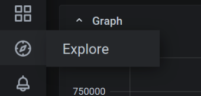

# 使用 Prometheus 监控 `etcd`

## docker
```yml
version: '3.5'
services:
    machine-1:
        image: quay.io/coreos/etcd:v3.4.9
        hostname: machine-1
        container_name: machine-1
        command: etcd --data-dir=data.etcd --name machine-1 --initial-advertise-peer-urls http://machine-1:2380 --listen-peer-urls http://0.0.0.0:2380 --advertise-client-urls http://machine-1:2379 --listen-client-urls http://0.0.0.0:2379 --initial-cluster machine-1=http://machine-1:2380,machine-2=http://machine-2:2380,machine-3=http://machine-3:2380 --initial-cluster-state new --initial-cluster-token etcd-token-01
        ports:
            - 10001:2379
        networks:
            - etcd-net

    machine-2:
        image: quay.io/coreos/etcd:v3.4.9
        hostname: machine-2
        container_name: machine-2
        command: etcd --data-dir=data.etcd --name machine-2 --initial-advertise-peer-urls http://machine-2:2380 --listen-peer-urls http://0.0.0.0:2380 --advertise-client-urls http://machine-2:2379 --listen-client-urls http://0.0.0.0:2379 --initial-cluster machine-1=http://machine-1:2380,machine-2=http://machine-2:2380,machine-3=http://machine-3:2380 --initial-cluster-state new --initial-cluster-token etcd-token-01
        ports:
            - 10002:2379
        networks:
            - etcd-net

    machine-3:
        image: quay.io/coreos/etcd:v3.4.9
        hostname: machine-3
        container_name: machine-3
        command: etcd --data-dir=data.etcd --name machine-3 --initial-advertise-peer-urls http://machine-3:2380 --listen-peer-urls http://0.0.0.0:2380 --advertise-client-urls http://machine-3:2379 --listen-client-urls http://0.0.0.0:2379 --initial-cluster machine-1=http://machine-1:2380,machine-2=http://machine-2:2380,machine-3=http://machine-3:2380 --initial-cluster-state new --initial-cluster-token etcd-token-01
        ports:
            - 10003:2379
        networks:
            - etcd-net

    client:
        image: quay.io/coreos/etcd:v3.4.9
        hostname: etcd-client
        container_name: etcd-client
        environment:
            - ETCDCTL_API=3
            - ENDPOINTS=machine-1:2379,machine-2:2379,machine-3:2379
        command: sh
        stdin_open: true # docker run -i
        tty: true        # docker run -t
        networks:
            - etcd-net

    prometheus:
        image: prom/prometheus:v2.20.1
        ports:
            - 9090:9090
        volumes:
            - ./etcd-prometheus.yml:/etc/prometheus/prometheus.yml
        networks:
            - etcd-net
    
    grafana:
        image: grafana/grafana:7.1.3
        ports:
            - 3000:3000
        networks:
            - etcd-net
                   
networks:
    etcd-net:
        name: etcd-net
```

新增`prometheus` 和 `grafana` 的 `docker` 镜像

```bash
docker-compose up -d
```

## prometheus 网页
prometheus 配置文件信息如下
```yml
global:
  scrape_interval: 10s
scrape_configs:
  - job_name: etcd-prometheus
    static_configs:
    - targets: ['machine-1:2379','machine-2:2379','machine-3:2379']
```

- 打开网页 http://127.0.0.1:9090
- 输入框内输入 `etcd_mvcc_put_total` 表示所有`etcd`节点调用 `put` 的次数


效果如下


## grafana 网页
- 打开网页 http://127.0.0.1:3000/login
- 用户名为 `admin`，以管理员登录，默认密码为 `admin`


- 第一次登录提示修改密码


- 点击配置，选择 `Data Sources` 添加数据源


- 选择 `Prometheus` 数据源


- 设置 `Promethesu`
    - URL : http://127.0.0.1:9090
    - Access : Browser


-  点击预览



- 与 `Prometheus` 操作界面类似，在输入框内输入 `etcd_mvcc_put_total`，效果如下


## 比较重要的监控参数
- process_open_fds
- process_max_fds

已经打开的文件描述符数目和最大的文件描述符数目，使用这个可以简介见识当前 `etcd` 链接几个客户端

## 参考资料
- https://etcd.io/docs/v3.1.12/op-guide/monitoring/
- https://prometheus.io/docs/prometheus/latest/installation/
- https://grafana.com/docs/grafana/latest/installation/docker/
