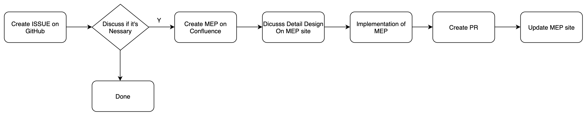
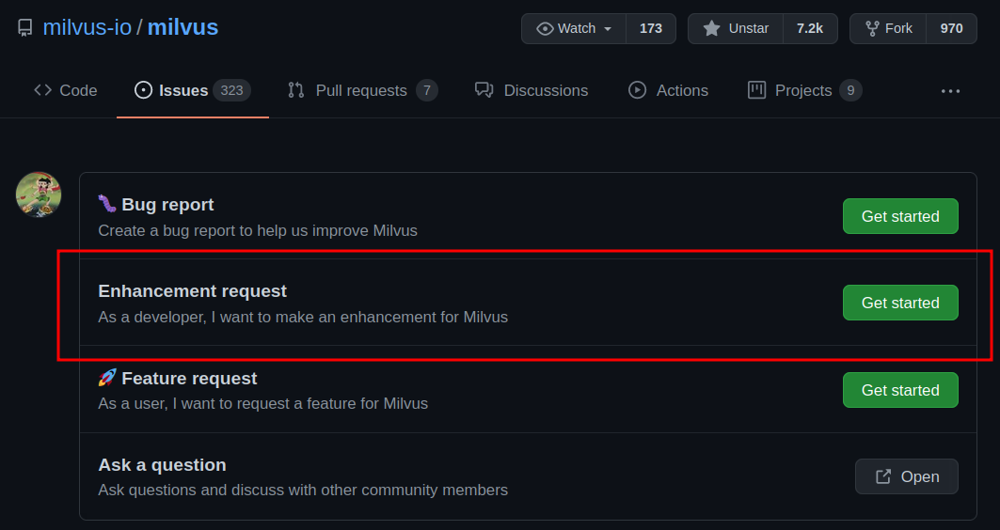
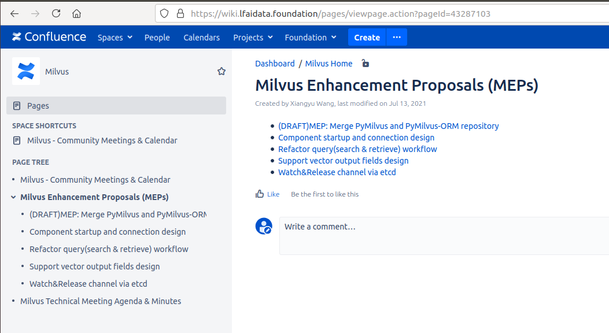
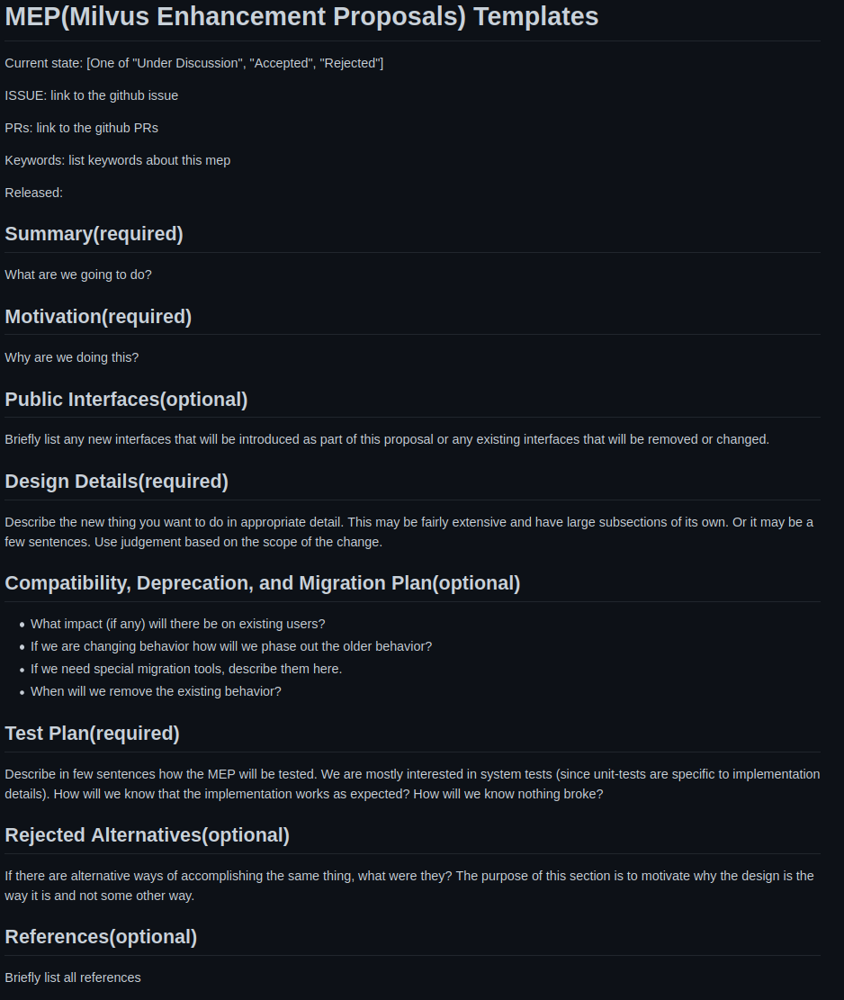
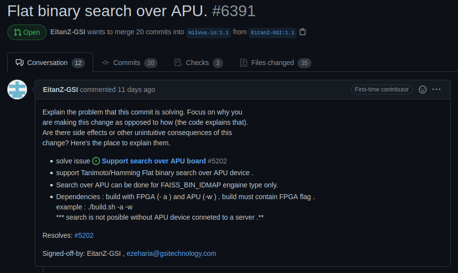
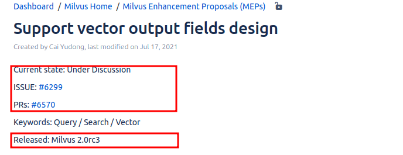

# MEP workflow

## STEP 1 - Create ISSUE
Let's discuss if this `Enhancement` is necessary at this step.

## STEP 2 - Create MEP
Let's discucc the detail design at this step.

MEP site : <https://wiki.lfaidata.foundation/pages/viewpage.action?pageId=43287103>

MEP template : <https://github.com/milvus-io/milvus/blob/master/docs/design_docs/MEP-Template.md>

## STEP 3 - Implementataion && Create PR

## STEP 4 - Update MEP
