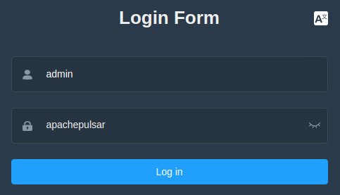
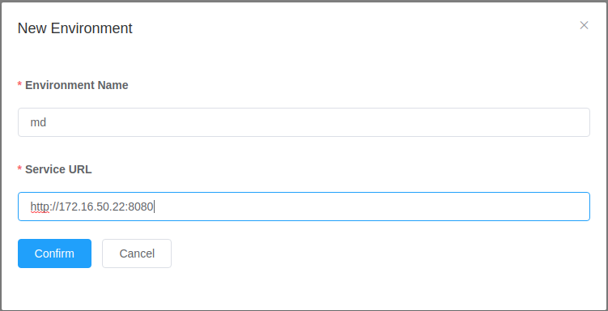
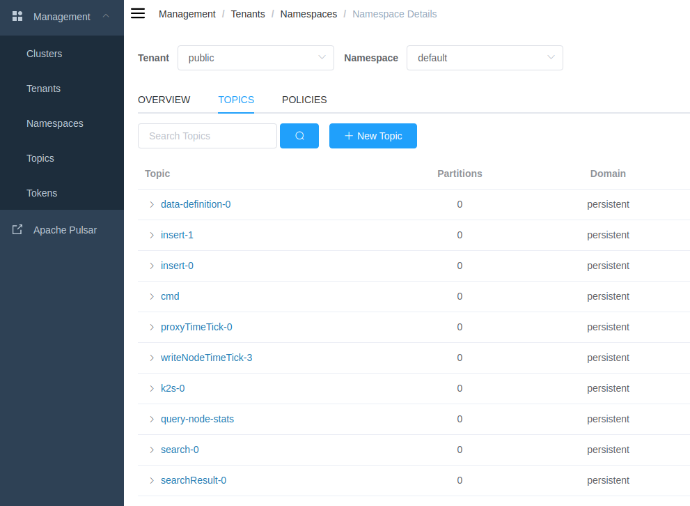

# 使用 `pulsar manager` 监控 `puslar`

## docker-compose
```yml
version: '3.5'

services:
  pulsar:
    image: apachepulsar/pulsar:latest
    command: bin/pulsar standalone
    ports:
      - "6650:6650"
      - "8080:8080"

  manager:
    image: apachepulsar/pulsar-manager:v0.2.0
    environment:
      SPRING_CONFIGURATION_FILE : /pulsar-manager/pulsar-manager/application.properties
    ports:
      - "9527:9527"
      - "7750:7750"
```

启动 `pulsar` 及 `pulsar-manager`
```bash
docker-compose up -d
```

## 设置 `pulsar manager` 的用户名及密码
```bash
CSRF_TOKEN=$(curl http://localhost:7750/pulsar-manager/csrf-token)
curl \
   -H 'X-XSRF-TOKEN: $CSRF_TOKEN' \
   -H 'Cookie: XSRF-TOKEN=$CSRF_TOKEN;' \
   -H "Content-Type: application/json" \
   -X PUT http://localhost:7750/pulsar-manager/users/superuser \
   -d '{"name": "admin", "password": "apachepulsar", "description": "test", "email": "username@test.org"}'
```

**注意：需要关闭当前终端的代理**

## 登录 `pulsar manager`
打开浏览器，登录 <http://localhost:9527/>，输入用户名:`admin`,密码:`apachepulsar`,登录




## 获得本机 `ip` 地址
```bash
$ ifconfig
enp7s0: flags=4163<UP,BROADCAST,RUNNING,MULTICAST>  mtu 1500
        inet 172.16.50.22  netmask 255.255.255.0  broadcast 172.16.50.255
        inet6 fe80::1480:8160:ca1d:a8f  prefixlen 64  scopeid 0x20<link>
        ether 4c:ed:fb:c7:4d:d1  txqueuelen 1000  (Ethernet)
        RX packets 950555  bytes 963410334 (963.4 MB)
        RX errors 0  dropped 0  overruns 0  frame 0
        TX packets 474695  bytes 82442308 (82.4 MB)
        TX errors 0  dropped 0 overruns 0  carrier 0  collisions 0
```
## 新建监控环境
在 `pulsar manager` 的页面上，点击 `New Environment`，`Environment Name`:`md`, `Service URL`:`http://172.16.50.22:8080`



**注意：此处URL的ip必须为本机地址，不能为localhost或127.0.0.1**

点击右侧的 `Topics` 可以观察到当前 `pulsar` 内的所有 `topic`




目前测试发现 `pulsar manager` 只能观察当前 `pulsar` 内的所有 `topic`，以及这些 `topic` 有几个 `Producer` 和 `Consumer`，但是不能下载具体某条消息，观察消息内容是否正确